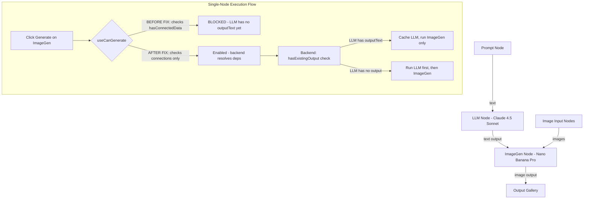
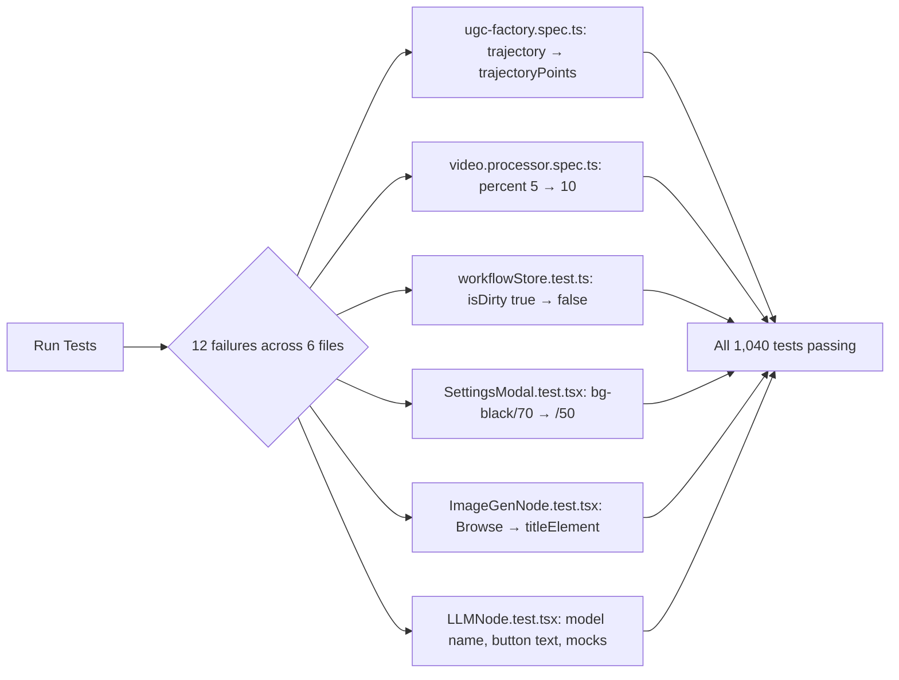
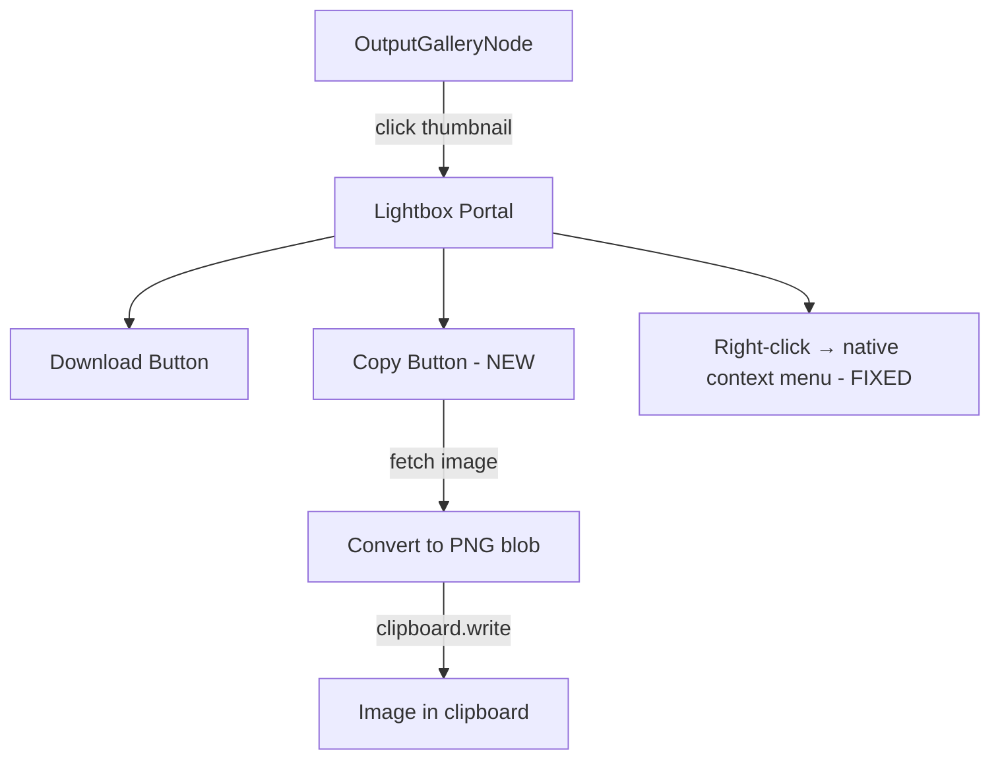
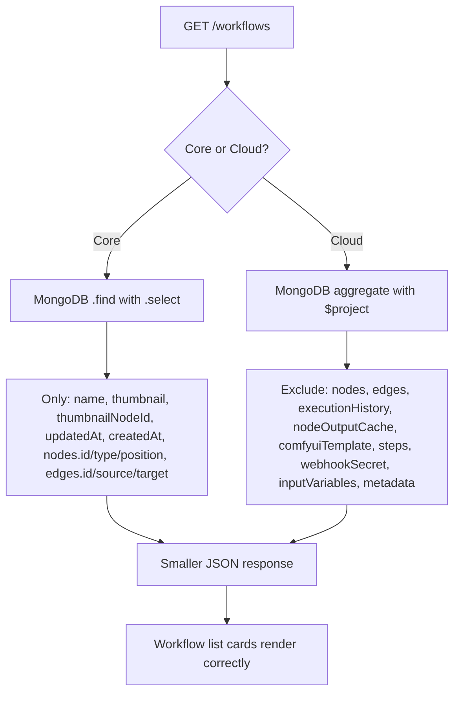
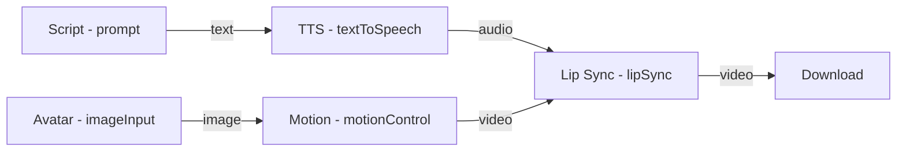
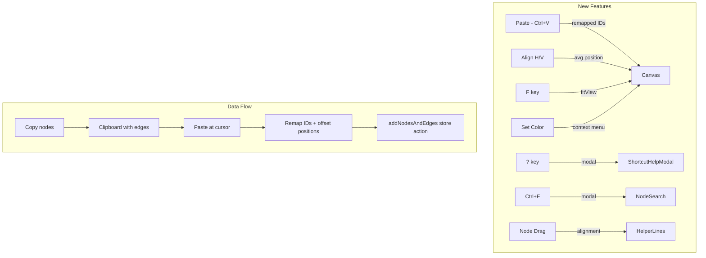

# 2026-02-05 Sessions

---

## Session 1: KlingQuality Enum Migration, canGenerate Fix, Output Gallery & LLM Node Improvements

**Time:** ~2:00 AM
**Context:** Continued from previous session (context compacted). Major focus on enum migration, fixing single-node execution validation, and multiple UX/backend fixes.

### System Flow Diagram

### Affected Components

| Layer | Components |
|-------|-----------|
| Frontend | `useCanGenerate.ts`, `ImageGenNode.tsx`, `LLMNode.tsx`, `nodeSlice.ts`, `WorkflowCanvas.tsx`, `OutputGalleryNode.tsx` |
| Backend | `video.processor.ts`, `replicate.service.ts`, `job-data.interface.ts`, `llm.processor.ts` |
| Types | `enums.ts`, `ai-nodes.ts`, `registry.ts` |
| API Route | `providers/models/route.ts` |

### What Was Done

- [x] **KlingQuality enum migration** - Replaced string literals `'pro'`/`'standard'` with `KlingQuality.PRO`/`KlingQuality.STANDARD` enum values
  - Created `KlingQuality` enum in `packages/types/src/enums.ts`
  - Updated `MotionControlJobData` interface to use `qualityMode?: KlingQuality`
  - Updated `video.processor.ts` to use enum for quality comparison
  - Updated `replicate.service.ts` `MotionControlInput.quality` to use `KlingQuality` type
  - Added proper imports across all files
- [x] **Fixed canGenerate blocking single-node execution** - Removed `hasConnectedData` from `canGenerate` formula
  - `canGenerate` now only requires: connections exist + schema fields valid
  - Backend handles dependency resolution (runs upstream nodes first)
  - `hasConnectedData` kept as informational field but doesn't block Generate button
- [x] **Output Gallery accumulation fix** (from earlier in session) - Gallery now accumulates images across runs instead of replacing
- [x] **LLM Node improvements** (from earlier in session):
  - Improved output display: "Generated Output" label, max-h-48 scrollable, primary-tinted border
  - Added required validation: system prompt + input prompt required
  - Empty prompt node invalidates Generate button
  - Added Claude 4.5 Sonnet as LLM model option
- [x] **Fixed LLM prompt not reaching API** - Backend processor reads `inputPrompt ?? prompt` (field name mismatch fix)
- [x] **Edge animations for single-node execution** - Added CSS animations matching full workflow execution
- [x] **Expert agent review** - Ran 4 expert agents for code cleanup (memoization, shallow comparison, comment cleanup)
- [x] **Linter fixes** - Biome formatting fix, TypeScript pre-existing errors only

### Key Decisions

| Decision | Rationale |
|----------|-----------|
| Remove `hasConnectedData` from `canGenerate` | Backend resolves dependencies - frontend should only validate connections exist, not upstream data |
| Keep `hasConnectedData` as informational field | Other code may use it for display purposes without blocking |
| Use `KlingQuality` enum (STANDARD='std', PRO='pro') | User requested enums for all string literal unions; matches Kling API values |
| `qualityMode` field name (not `quality`) | Matches frontend `MotionControlNodeData.qualityMode` field name |

### Files Changed

**Frontend:**
- `apps/web/src/hooks/useCanGenerate.ts` - Removed `hasConnectedData` from `canGenerate` formula
- `apps/web/src/components/nodes/ai/ImageGenNode.tsx` - (earlier) improved validation display
- `apps/web/src/components/nodes/ai/LLMNode.tsx` - (earlier) output display, required fields, Claude model
- `apps/web/src/store/workflow/slices/nodeSlice.ts` - (earlier) gallery accumulation fix
- `apps/web/src/components/canvas/WorkflowCanvas.tsx` - (earlier) single-node edge animations
- `apps/web/src/app/api/providers/models/route.ts` - (earlier) Claude 4.5 Sonnet in model browser
- `apps/web/src/lib/models/registry.ts` - (earlier) Claude model registry entry

**Backend:**
- `apps/api/src/processors/video.processor.ts` - KlingQuality enum import + usage
- `apps/api/src/services/replicate.service.ts` - KlingQuality enum for MotionControlInput.quality type
- `apps/api/src/interfaces/job-data.interface.ts` - `qualityMode?: KlingQuality` + runtime import
- `apps/api/src/processors/llm.processor.ts` - (earlier) `inputPrompt ?? prompt` fix

**Types Package:**
- `packages/types/src/enums.ts` - Added `KlingQuality` enum
- `packages/types/src/nodes/ai-nodes.ts` - Re-exports `KlingQuality`, `KlingQualityMode` type alias

### Mistakes and Fixes

| Mistake | Fix |
|---------|-----|
| `useCanGenerate` required upstream data to exist before enabling Generate | Removed `hasConnectedData` from canGenerate - backend handles deps |
| Zustand infinite loop with `Array.from()` in selector | Use Map reference directly, add boolean selector |
| LLM processor read `nodeData.prompt` but frontend sends `inputPrompt` | Changed to `inputPrompt ?? prompt` pattern |
| `video.processor.ts` used `data.nodeData.quality` (wrong field name) | Changed to `data.nodeData.qualityMode` with enum |
| Import `type KlingQuality` prevented runtime enum usage | Changed to value import `KlingQuality` |

### Next Steps

- [ ] Verify LLM output is visible in node after single-node execution (user concern)
- [ ] Verify backend caching works for single-node ImageGen execution (LLM should be skipped)
- [ ] Consider adding cached output caching to full workflow execution (currently only partial execution caches)
- [ ] User may want a "confirm prompt" step in LLM workflow - currently fire-and-forget
- [ ] Run full integration test: Prompt → LLM → ImageGen with single-node execution on ImageGen

---

## Session 2: Insights Review & Tooling Setup

**Time:** Evening

### What Was Done

- [x] **Added CLAUDE.md sections from insights recommendations**
  - `## React / State Management` — referential equality checks for selectors to prevent infinite re-render loops
  - `## Development Workflow` — verify fixes in running dev server before assuming failure
  - `## API Routes` — validate route file paths match URL patterns, test with curl
- [x] **Created post-edit type-check hook** (`.claude/settings.json`)
  - `postToolUse` hook runs `npx tsc --noEmit` after every Edit/Write operation
  - Catches type errors immediately instead of compounding across edits
- [x] **Created `/bugfix` skill** (`.claude/skills/bugfix/SKILL.md`)
  - 6-step workflow: reproduce → root cause → fix → tsc → grep similar → verify routes
  - Enforces verification steps to reduce buggy code friction
- [x] **Parallel agent investigation of OutputGallery image flow**
  - Agent 1: Traced full 9-step data flow from execution to gallery render
  - Agent 2: Found HIGH severity bug — `propagateOutputsDownstream()` exits early when `outputImages` is `[]` (empty array)
  - Agent 3: Confirmed rendering logic is solid — no bugs in OutputGalleryNode component
- [x] **Established prompt scaffold templates** for future sessions
  - Fix Plan template (file + change + reason per step)
  - Verify Fix template (tsc + grep + curl)
  - Batch Bugs template (shared context + multiple descriptions)

### Key Decisions

| Decision | Rationale |
|----------|-----------|
| Add tsc hook on Edit/Write | Insights showed 298 buggy_code friction events; catching type errors immediately reduces iteration cycles |
| Create bugfix skill with verification steps | 35% dissatisfied rate from unverified fixes; enforce root cause analysis before changes |
| Use prompt scaffolds as templates | User operates as high-throughput orchestrator; standardized prompts yield cleanest results |

### Files Changed

- `CLAUDE.md` (workspace root) — Added Common Pitfalls, UI Changes, Debugging, Workflow sections
- `core/CLAUDE.md` — Added React/State Management, Development Workflow, API Routes sections
- `core/.claude/settings.json` — Created with postToolUse tsc hook
- `core/.claude/skills/bugfix/SKILL.md` — Created bugfix workflow skill

### Bug Found (Not Yet Fixed)

| Bug | Severity | Location | Issue |
|-----|----------|----------|-------|
| Empty array short-circuit | HIGH | `nodeSlice.ts:282` | `propagateOutputsDownstream()` exits early when `outputImages` is `[]` because `getNodeOutput()` returns `null` for empty arrays |

### Next Steps

- [ ] Fix the empty array short-circuit bug in `nodeSlice.ts` `getNodeOutput()` / `propagateOutputsDownstream()`
- [ ] Verify LLM output visible after single-node execution (carried from Session 1)
- [ ] Run full integration test: Prompt → LLM → ImageGen → OutputGallery

---

## Session 3: Fix All Failing Tests Across Project

**Time:** ~3:05 AM
**Context:** User requested finding and fixing all failing tests in the project.

### System Flow Diagram

### Affected Components

| Layer | Components |
|-------|-----------|
| Workflows Package | `__tests__/ugc-factory.spec.ts` |
| API Tests | `processors/video.processor.spec.ts` |
| Frontend Tests | `workflowStore.test.ts`, `SettingsModal.test.tsx`, `ImageGenNode.test.tsx`, `LLMNode.test.tsx` |

### What Was Done

- [x] **Ran full test suite** across all 5 packages (core, prompts, types, workflows, api, web) — 62 test files, 1,040 tests
- [x] **Fixed ugc-factory.spec.ts** — Test used `trajectory` but type uses `trajectoryPoints`
- [x] **Fixed video.processor.spec.ts** — `startJob()` in base processor uses `percent: 10`, test expected `5`
- [x] **Fixed workflowStore.test.ts** — `loadWorkflow()` now sets `isDirty: false` after propagation, test expected `true`
- [x] **Fixed SettingsModal.test.tsx** — Modal backdrop class changed from `bg-black/70` to `bg-black/50`
- [x] **Fixed ImageGenNode.test.tsx (4 tests)** — "Browse" button removed, replaced with clickable model name; updated BaseNode mock to render `titleElement`
- [x] **Fixed LLMNode.test.tsx (4 tests)** — Updated model display name, button text, added missing mocks (`useAutoLoadModelSchema`, `useModelSelection`, registry, `ModelBrowserModal`), provided valid `systemPrompt`/`inputPrompt` for `canGenerate`

### Key Decisions

| Decision | Rationale |
|----------|-----------|
| Fix tests to match source, not source to match tests | All source changes were intentional from Session 1/2; tests were stale |
| Update BaseNode mock to render `titleElement` | Source moved model browsing to `titleElement` prop; mock didn't render it |
| Add missing hook mocks to LLMNode test | Component added `useAutoLoadModelSchema`, `useModelSelection`, `ModelBrowserModal` imports that weren't mocked |
| Change LLM "Generating" test to not check disabled | Generating button is now a stop button (destructive variant), intentionally clickable |

### Files Changed

- `packages/workflows/__tests__/ugc-factory.spec.ts` — `trajectory` → `trajectoryPoints`
- `apps/api/src/processors/video.processor.spec.ts` — `percent: 5` → `percent: 10`
- `apps/web/src/store/workflowStore.test.ts` — `isDirty: true` → `isDirty: false`
- `apps/web/src/components/settings/SettingsModal.test.tsx` — `bg-black\\/70` → `bg-black\\/50`
- `apps/web/src/components/nodes/ai/ImageGenNode.test.tsx` — BaseNode mock + Browse → title selectors
- `apps/web/src/components/nodes/ai/LLMNode.test.tsx` — Model name, button text, missing mocks, canGenerate validation

### Mistakes and Fixes

| Mistake | Fix |
|---------|-----|
| First ImageGenNode fix used `getByTitle('Browse models')` but BaseNode mock didn't render `titleElement` | Added `titleElement` to BaseNode mock |
| LLM `queryByText('Generate')` would find headerActions button when checking body | Changed test to check `getByText('Generated output')` instead |
| LLM refresh button test found title button instead of refresh button | Used `getByTitle('Regenerate')` for precise targeting |

### Test Results

| Package | Tests | Status |
|---------|-------|--------|
| packages/core | 80 | ✅ All passing |
| packages/prompts | 10 | ✅ All passing |
| packages/types | 22 | ✅ All passing |
| packages/workflows | 20 | ✅ All passing |
| apps/api | 371 | ✅ All passing |
| apps/web | 589 | ✅ All passing |
| **Total** | **1,040** | **✅ All passing** |

### Next Steps

- [ ] Fix the empty array short-circuit bug in `nodeSlice.ts` (carried from Session 2)
- [ ] Verify LLM output visible after single-node execution (carried from Session 1)
- [ ] Run full integration test: Prompt → LLM → ImageGen → OutputGallery (carried)

---

## Session 4: Output Gallery Lightbox UX Improvements

**Time:** ~5:00 AM

### System Flow Diagram

### Affected Components

| Layer | Components |
|-------|-----------|
| Frontend | `OutputGalleryNode.tsx` |

### What Was Done

- [x] **Added Copy Image button** next to Download in lightbox
  - Fetches image URL, converts to PNG blob (canvas fallback for non-PNG sources)
  - Uses `navigator.clipboard.write()` with `ClipboardItem`
  - Positioned in flex container with Download button (top-left, `gap-2`)
- [x] **Fixed right-click on lightbox images** — Added `onContextMenu={(e) => e.stopPropagation()}` on lightbox overlay to prevent React Flow's canvas context menu handler from intercepting
- [x] **Replaced all inline SVGs with lucide-react icons** — `X`, `Download`, `Copy`, `ChevronLeft`, `ChevronRight` (5 SVGs replaced)
- [x] **Gallery images now ordered newest first** — Added `.reverse()` to `displayImages` array (images accumulate oldest-first via `nodeSlice.ts`, reverse shows newest at top of grid)

### Key Decisions

| Decision | Rationale |
|----------|-----------|
| Use `navigator.clipboard.write()` with PNG conversion | Clipboard API requires `image/png` MIME type; source images may be JPEG/WebP |
| Canvas fallback for non-PNG images | `toBlob('image/png')` converts any format; falls back to original blob on error |
| `onContextMenu` stopPropagation on overlay | Lightbox is portaled to `document.body` but React Flow's pane context menu handler still intercepts; stopping propagation restores native right-click |
| `.reverse()` on display array | Images append oldest-first during execution; reversing shows newest at top without changing store logic |
| lucide-react over inline SVGs | Project already uses lucide-react across all other node components |

### Files Changed

- `apps/web/src/components/nodes/processing/OutputGalleryNode.tsx`
  - Added `lucide-react` import (`X`, `Download`, `Copy`, `ChevronLeft`, `ChevronRight`)
  - Added `copyImage` callback with fetch → PNG conversion → clipboard write
  - Added Copy button in flex container next to Download
  - Added `onContextMenu` stopPropagation on lightbox overlay
  - Replaced 5 inline SVGs with lucide-react components
  - Added `.reverse()` to `displayImages` for newest-first ordering

### Next Steps

- [ ] Fix the empty array short-circuit bug in `nodeSlice.ts` (carried from Session 2)
- [ ] Verify LLM output visible after single-node execution (carried from Session 1)
- [ ] Run full integration test: Prompt → LLM → ImageGen → OutputGallery (carried)

---

## Session 5: Optimize GET /workflows Payload (Core + Cloud)

**Time:** ~Late night
**Context:** User provided a plan to optimize the GET /workflows list endpoint in both Core and Cloud APIs by stripping heavy fields not needed by list views.

### System Flow Diagram

### Affected Components

| Layer | Components |
|-------|-----------|
| Core API | `apps/api/src/services/workflows.service.ts` — `findAll()` method |
| Cloud API | `cloud/apps/server/api/src/collections/workflows/controllers/workflows.controller.ts` — `findAll()` method |

### What Was Done

- [x] **Core API: Added `.select()` projection to `findAll()`** — Projects only list-view fields: `name`, `thumbnail`, `thumbnailNodeId`, `updatedAt`, `createdAt`, `nodes.id`, `nodes.type`, `nodes.position`, `edges.id`, `edges.source`, `edges.target`
- [x] **Core API: Added `.lean()`** — Returns plain JS objects instead of Mongoose documents for faster serialization
- [x] **Cloud API: Added `$project` exclusion stage** — Excludes 9 heavy fields: `comfyuiTemplate`, `edges`, `executionHistory`, `inputVariables`, `metadata`, `nodeOutputCache`, `nodes`, `steps`, `webhookSecret`

### Key Decisions

| Decision | Rationale |
|----------|-----------|
| Use inclusion projection (`.select()`) for Core | Core list view needs specific node/edge sub-fields (`nodes.id`, `nodes.type`, `nodes.position`); inclusion is precise |
| Use exclusion projection (`$project: 0`) for Cloud | Cloud serializer maps attributes like `brand`/`tasks`/`key` that may not match schema fields; excluding known heavy fields is safer than whitelisting |
| Add `.lean()` to Core query | List view doesn't need Mongoose document methods; plain objects are faster to serialize |
| `...undefined` is a no-op in JS | `WorkflowPreview` does `{ ...node.data, nodeType: node.type }` — when `node.data` is absent, spread is harmless, result is `{ nodeType: node.type }` which is all `PreviewNodeComponent` reads |

### Files Changed

- `core/apps/api/src/services/workflows.service.ts` (line 61-70) — Added `.select()` and `.lean()` to `findAll()`
- `cloud/apps/server/api/src/collections/workflows/controllers/workflows.controller.ts` (line 619-631) — Added `$project` exclusion stage to aggregate pipeline

### Verification Steps

- [ ] Core: `curl http://localhost:3001/workflows` — confirm nodes have only `id`, `type`, `position` (no `data`)
- [ ] Cloud: `curl http://local.genfeed.ai:3001/api/workflows` — confirm smaller response, `label`/`status`/`trigger`/`description` still present
- [ ] UI: "Your Workflows" page renders cards with thumbnails, names, time ago, node counts

### Next Steps

- [ ] Fix the empty array short-circuit bug in `nodeSlice.ts` (carried from Session 2)
- [ ] Verify LLM output visible after single-node execution (carried from Session 1)
- [ ] Run full integration test: Prompt → LLM → ImageGen → OutputGallery (carried)
- [ ] Verify workflow list optimization in running dev server

---

## Session 6: Node Category Cleanup & Reorganization

**Time:** ~Late night
**Context:** 4-part refactor to clean up node categories: remove Template, remove Distribution, move display nodes to output, rename Output→Download.

### What Was Done

- [x] **Removed Template node** — Redundant since Prompt node has library picker and PromptConstructor handles variable interpolation
- [x] **Removed all 10 Distribution nodes** — No frontend components existed; backend had 3 partial implementations. Moving to cloud/ SaaS
- [x] **Moved OutputGallery & ImageCompare to output category** — Both are display-only terminal nodes
- [x] **Renamed Output node → Download** (hard rename, no backward compat)

### Files Changed

**Deleted:** `TemplateNode.tsx`, `distribution-nodes.ts`, `distribution-nodes.spec.ts`, `apps/api/src/nodes/distribution/` (5 files)

**Types:** `base.ts`, `input-nodes.ts`, `processing-nodes.ts`, `union.ts`, `registry.ts`, `index.ts`
**Frontend:** `nodes/index.ts`, `input/index.ts`, `output/OutputNode.tsx`, `output/index.ts`, `BaseNode.tsx`, `NodePalette.tsx`, `nodeSlice.ts`, `persistenceSlice.ts`, `mediaExtraction.ts`, `globals.scss`, `generate-workflow/route.ts`
**Backend:** `queue.constants.ts`, `queue.module.ts`, `processing.processor.ts`, `processing.processor.spec.ts`, `job-data.interface.ts`, `workflows.service.ts`

---

## Session 7: propagateOutputsDownstream Refactoring & Cleanup

**Time:** Late night
**Context:** Multi-step refactoring to extract propagation logic from nodeSlice.ts into a dedicated helper module, then consolidate duplicate `getNodeOutput` implementations.

### What Was Done

- [x] **Extracted propagation logic to `propagation.ts`** — Created `apps/web/src/store/workflow/helpers/propagation.ts` with `getNodeOutput()`, `mapOutputToInput()`, `propagateOutputsDownstream()`, and `extractOutputValue()`
- [x] **Refactored `nodeSlice.ts`** — Replaced inline propagation logic with imports from `propagation.ts`
- [x] **Wrote 53 unit tests** — `propagation.test.ts` covering all propagation functions
- [x] **Consolidated duplicate `getNodeOutput`** — Two implementations existed:
  - `propagation.ts` (authoritative): returns `string | null`, checks `outputImages` array FIRST, includes `outputAudio`, `video`
  - `nodeHelpers.ts` (stale): returns `unknown`, missing `outputImages` priority check, missing `outputAudio`/`video`
  - Switched `lockingSlice.ts` import from `nodeHelpers` to `propagation`
  - Deleted stale `getNodeOutput` from `nodeHelpers.ts`, removed unused `WorkflowNodeData` import

### Key Decisions

| Decision | Rationale |
|----------|-----------|
| Extract to `helpers/propagation.ts` | Propagation logic was 200+ lines embedded in nodeSlice; pure functions are independently testable |
| Keep `nodeHelpers.ts` for `generateId`/`getHandleType` | Still used by `nodeSlice.ts`, `edgeSlice.ts`, `groupSlice.ts` — only `getNodeOutput` was stale |
| Use authoritative `propagation.ts` version for locking | `nodeHelpers` version missed `outputImages` array check — locked multi-output nodes (imageGen) would cache `null` instead of the first generated image |

### Files Changed

- `apps/web/src/store/workflow/helpers/propagation.ts` — Created (authoritative propagation logic)
- `apps/web/src/store/workflow/helpers/propagation.test.ts` — Created (53 tests)
- `apps/web/src/store/workflow/slices/nodeSlice.ts` — Refactored to import from propagation.ts
- `apps/web/src/store/workflow/slices/lockingSlice.ts` — Switched `getNodeOutput` import to `propagation.ts`
- `apps/web/src/store/workflow/helpers/nodeHelpers.ts` — Removed stale `getNodeOutput` function + unused `WorkflowNodeData` import

### Bug Fixed

| Bug | Severity | Fix |
|-----|----------|-----|
| Locked multi-output nodes cache `null` | HIGH | `lockingSlice.ts` now uses `propagation.ts` `getNodeOutput()` which checks `outputImages` array first |

---

## Session 8: UGC Factory Cleanup + Template Integration

**Time:** Late night
**Context:** Clean up UGC Factory workflow JSON (remove 8 distribution nodes, add download node), register as loadable template in Templates Modal.

### System Flow Diagram

### Affected Components

| Layer | Components |
|-------|-----------|
| Workflows Package | `workflows/ugc-factory.json`, `src/index.ts`, `__tests__/ugc-factory.spec.ts` |
| Frontend | `templates/ugc-factory.ts` (new), `templates/index.ts` |
| Docs | `.agents/PRDS/ugc-factory-integration.md` |

### What Was Done

- [x] **Cleaned ugc-factory.json** — Removed 8 distribution nodes (telegram, discord, twitter, instagram, tiktok, youtube, google drive, webhook) and 11 edges; added `download` node + 1 edge. Final: 6 nodes, 5 edges
- [x] **Created template file** — `apps/web/src/templates/ugc-factory.ts` exporting `UGC_FACTORY_TEMPLATE` following existing template patterns
- [x] **Registered template** — Added to `TEMPLATE_REGISTRY`, `TEMPLATE_INFO` (category: VIDEO), and exports in `templates/index.ts`
- [x] **Updated workflow registry** — Changed `outputTypes` from `['video', 'image']` to `['video']`, updated description
- [x] **Rewrote test** — 9 tests, 39 assertions. Asserts 6 nodes / 5 edges, full pipeline connectivity, TTS config, motion control settings, download node
- [x] **Closed PRD** — Marked all 5 items done. Multi-format handled by motionControl aspectRatio field, batch handled by BottomBar batch runner

### Key Decisions

| Decision | Rationale |
|----------|-----------|
| Remove all distribution nodes | No frontend components existed; moving to cloud/ SaaS |
| Add `download` node (not `output`) | Output→Download rename happened in Session 6; `download` is the current type |
| Mark multi-format as done | motionControl node has configurable aspectRatio (16:9, 9:16, 1:1) |
| Mark batch as done | BottomBar already has batch runner (1–10x) that re-executes workflows |
| No thumbnail for template | Uses `WorkflowPreview` fallback like other templates without thumbnails |

### Files Changed

- `packages/workflows/workflows/ugc-factory.json` — Removed 8 distribution nodes + 11 edges, added download node + 1 edge
- `apps/web/src/templates/ugc-factory.ts` — **New** — template definition
- `apps/web/src/templates/index.ts` — Import + register in TEMPLATE_REGISTRY, TEMPLATE_INFO, exports
- `packages/workflows/src/index.ts` — Updated outputTypes to `['video']`, description
- `packages/workflows/__tests__/ugc-factory.spec.ts` — Rewrote: 9 tests, 39 assertions, no distribution references
- `.agents/PRDS/ugc-factory-integration.md` — All 5/5 items checked, updated date, updated architecture diagram

### Test Results

| Package | Tests | Status |
|---------|-------|--------|
| packages/workflows (ugc-factory) | 9 | All passing (39 assertions) |

---

## Session 9: Canvas Best Practices Implementation (n8n/ComfyUI/Figma Patterns)

**Time:** ~Late night
**Context:** Implementing industry-standard canvas features from n8n, ComfyUI, and Figma to bring Genfeed Core canvas to parity with professional node editors.

### System Flow Diagram

### Affected Components

| Layer | Components |
|-------|-----------|
| Frontend - Hooks | `useContextMenu.ts`, `useNodeActions.ts`, `useCanvasKeyboardShortcuts.ts`, `usePaneActions.ts` |
| Frontend - Canvas | `WorkflowCanvas.tsx`, `HelperLines.tsx` (new), `NodeSearch.tsx` (new), `ShortcutHelpModal.tsx` (new) |
| Frontend - Context Menu | `nodeMenu.tsx`, `selectionMenu.tsx`, `paneMenu.tsx` |
| Frontend - Nodes | `BaseNode.tsx` |
| Store | `nodeSlice.ts`, `types.ts`, `uiStore.ts` |
| Types | `base.ts` (color field) |
| Constants | `colors.ts` (NODE_COLORS) |

### What Was Done

- [x] **Fix Paste Functionality** — Full implementation with ID remapping, position offset, edge reconnection
  - Added `getPasteData`, `copyMultipleNodes`, `cutMultipleNodes` to `useNodeActions.ts`
  - Added `addNodesAndEdges` batch action to `nodeSlice.ts` and `types.ts`
  - Context menu paste converts screen position to flow coordinates
- [x] **Fix Align Horizontally/Vertically** — Aligns selected nodes to average X or Y position
  - Horizontal: all nodes get same Y (average)
  - Vertical: all nodes get same X (average)
- [x] **F key fit-to-selection** — Fits view to selected nodes, or all nodes if none selected
  - Added `fitView`, `openShortcutHelp`, `openNodeSearch` props to keyboard shortcuts hook
  - Added `nodes` prop for filtered fitView
- [x] **? key shortcut help modal** — Searchable modal with all keyboard shortcuts
  - Created `ShortcutHelpModal.tsx` with categorized shortcuts (Navigation, Selection, Editing, Nodes, Organization, Help)
  - Uses existing `Modal` component
- [x] **Ctrl+F node search** — Fuzzy search nodes by name, type, or comment
  - Created `NodeSearch.tsx` with keyboard navigation (arrow keys + Enter)
  - Selecting a node fits view and selects it
- [x] **Individual node colors** — Custom border colors for visual organization
  - Added `color?: string` to `BaseNodeData` in types
  - Applied custom border color in `BaseNode.tsx` (uses `effectiveColor` for ring/border)
  - Added color picker submenu to node context menu (9 colors: none + 8 palette colors)
  - Created `NODE_COLORS`, `NODE_COLOR_VALUES`, `NODE_COLOR_LABELS` constants
- [x] **Figma-style helper lines** — Alignment guides during node drag
  - Created `HelperLines.tsx` with SVG overlay
  - Detects left/right/center X alignments and top/bottom/center Y alignments
  - Blue dashed lines appear within 5px threshold
  - Added `draggingNodeId` state and drag handlers to `WorkflowCanvas.tsx`

### Key Decisions

| Decision | Rationale |
|----------|-----------|
| Use average position for alignment | Simpler than "align to first selected" or "distribute evenly"; matches common behavior |
| Helper lines don't snap | Snapping requires modifying node position during drag which can cause jitter; lines are visual guides only |
| 9 node colors matching group palette | Reuse existing color system for consistency; "none" clears custom color |
| Custom color uses border-2 | Thicker border makes custom color more visible than category color |
| NodeSearch uses existing Modal component | Project doesn't have Dialog/Command components; Modal works well |

### Files Changed

**New Files:**
- `apps/web/src/components/canvas/ShortcutHelpModal.tsx` — Shortcut help modal
- `apps/web/src/components/canvas/NodeSearch.tsx` — Node search modal
- `apps/web/src/components/canvas/HelperLines.tsx` — Alignment helper lines

**Modified:**
- `apps/web/src/hooks/useNodeActions.ts` — Added paste, copy/cut multiple, getPasteData
- `apps/web/src/hooks/useContextMenu.ts` — Paste, align, setNodeColor implementations
- `apps/web/src/hooks/useCanvasKeyboardShortcuts.ts` — F, ?, Ctrl+F shortcuts + new props
- `apps/web/src/components/canvas/WorkflowCanvas.tsx` — New modals, helper lines, drag handlers
- `apps/web/src/components/context-menu/menus/nodeMenu.tsx` — Color picker submenu
- `apps/web/src/components/nodes/BaseNode.tsx` — Custom color border styling
- `apps/web/src/store/workflow/slices/nodeSlice.ts` — `addNodesAndEdges` action
- `apps/web/src/store/workflow/types.ts` — `addNodesAndEdges` type
- `apps/web/src/store/uiStore.ts` — `shortcutHelp`, `nodeSearch` modal types
- `packages/types/src/nodes/base.ts` — `color?: string` field
- `apps/web/src/lib/constants/colors.ts` — NODE_COLORS, NODE_COLOR_VALUES, NODE_COLOR_LABELS

### Verification Checklist

- [ ] **Paste:** Copy nodes → Ctrl+V → nodes appear offset from originals with new IDs
- [ ] **Align:** Select 3+ nodes → right-click → Align Horizontally → all Y positions match
- [ ] **F key:** Select node → press F → viewport centers on that node
- [ ] **? key:** Press ? → modal shows all shortcuts
- [ ] **Node colors:** Right-click node → Set Color → node border changes
- [ ] **Search:** Ctrl+F → type node name → Enter → viewport jumps to node
- [ ] **Helper lines:** Drag node near another → blue guide line appears

### Next Steps

- [ ] Fix the empty array short-circuit bug in `nodeSlice.ts` (carried from Session 2)
- [ ] Verify LLM output visible after single-node execution (carried from Session 1)
- [ ] Run full integration test: Prompt → LLM → ImageGen → OutputGallery (carried)
- [ ] Test all new canvas features in running dev server
- [ ] Consider adding snap-to-line functionality for helper lines (optional enhancement)

---

## Session 10: Codebase DRY, Performance & Optimization

**Time:** Late night
**Context:** Deep audit refactoring to eliminate ~350 lines of duplicate code, add performance optimizations (useShallow / individual selectors), and create 5 reusable abstractions.

### What Was Done

**Tier 1 — High Impact (DRY + Performance):**
- [x] **Extract `createPastePayload` helper** — Deduped 95% identical `pasteNodes`/`getPasteData` in `useNodeActions.ts` (~50 lines saved)
- [x] **Add individual selectors to `useNodeActions.ts`** — Replaced `useWorkflowStore()` full-store destructuring with `selectNodes`, `selectEdges`, `selectRemoveNode`, `selectDuplicateNode`
- [x] **Extract `propagateExistingOutputs` helper** — Deduped identical 13-line blocks in `loadWorkflow` and `loadWorkflowById` in `persistenceSlice.ts`
- [x] **Deduplicate `FileUploadResult` interface** — Moved to `types/files.ts`, removed from both `ImageInputNode.tsx` and `VideoInputNode.tsx`
- [x] **Create `useMediaUpload` hook** — Extracted shared upload/URL/remove logic from `ImageInputNode` and `VideoInputNode` (~120 lines saved)
- [x] **Create media utilities** — `getImageDimensions()` and `getVideoMetadata()` extracted to `lib/utils/media.ts`
- [x] **Memoize `modelDisplayName`** — Added `useMemo` to `ImageGenNode` and `VideoGenNode` (already memoized in `LLMNode`)

**Tier 2 — Medium Impact (DRY + Architecture):**
- [x] **Create `useAIGenNodeHeader` hook** — Extracted identical titleElement + headerActions pattern from `ImageGenNode`, `VideoGenNode`, `LLMNode` (~90 lines saved)
- [x] **Create `useNodeFieldUpdater` hook** — Generic field-update callback factory, applied to `UpscaleNode` (replaced 5 identical `useCallback` wrappers)
- [x] **`useShallow` audit** — Converted 6 hooks/components from full-store destructuring to individual selectors:
  - `useContextMenu.ts` — 8 individual selectors
  - `useGlobalShortcuts.ts` — `selectSelectedNodeIds` + inline selector
  - `useOptimalHandleOrder.ts` — `selectEdges`
  - `usePaneActions.ts` — `selectAddNode`
  - `BaseNode.tsx` — 6 individual selectors (3 UIStore + 3 WorkflowStore)

**Tier 3 — Polish:**
- [x] **Extract magic numbers in BaseNode** — `NODE_MIN_WIDTH`, `NODE_MAX_WIDTH`, `NODE_RESIZER_MAX_WIDTH`, `DOWNLOAD_NODE_MIN_WIDTH`, `DOWNLOAD_NODE_MIN_HEIGHT`, `NODE_MIN_HEIGHT`
- [x] **Standardize import ordering in BaseNode** — External packages → internal packages → path aliases
- [x] **Added missing selectors** — `selectRemoveEdge`, `selectAddNodesAndEdges` to `selectors.ts`

### New Files Created

| File | Purpose |
|------|---------|
| `apps/web/src/hooks/useMediaUpload.ts` | Shared file upload + URL input logic for input nodes |
| `apps/web/src/hooks/useAIGenNodeHeader.tsx` | Shared title/header elements for AI generation nodes |
| `apps/web/src/hooks/useNodeFieldUpdater.ts` | Generic node field update callback factory |
| `apps/web/src/lib/utils/media.ts` | `getImageDimensions()`, `getVideoMetadata()` utilities |
| `apps/web/src/types/files.ts` | Shared `FileUploadResult` interface |

### Files Modified

| File | Changes |
|------|---------|
| `useNodeActions.ts` | Extract `createPastePayload`, individual selectors |
| `persistenceSlice.ts` | Use `propagateExistingOutputs` helper |
| `propagation.ts` | Add `propagateExistingOutputs` function |
| `selectors.ts` | Add `selectRemoveEdge`, `selectAddNodesAndEdges` |
| `types/index.ts` | Re-export `files.ts` |
| `ImageInputNode.tsx` | Use `useMediaUpload`, remove duplicate interface |
| `VideoInputNode.tsx` | Use `useMediaUpload`, remove duplicate interface |
| `ImageGenNode.tsx` | Use `useAIGenNodeHeader`, memoize `modelDisplayName` |
| `VideoGenNode.tsx` | Use `useAIGenNodeHeader`, memoize `modelDisplayName` |
| `LLMNode.tsx` | Use `useAIGenNodeHeader` |
| `UpscaleNode.tsx` | Use `useNodeFieldUpdater` for 5 field handlers |
| `useContextMenu.ts` | Individual selectors (8 fields) |
| `useGlobalShortcuts.ts` | Individual selectors |
| `useOptimalHandleOrder.ts` | `selectEdges` |
| `usePaneActions.ts` | `selectAddNode` |
| `BaseNode.tsx` | Individual selectors, magic number constants, import ordering |

### Net Impact

- **~350 lines removed** (duplicate code eliminated)
- **5 new shared files** (reusable hooks and utils)
- **Performance**: Reduced unnecessary re-renders across all hooks/components that previously subscribed to the entire store
- **Zero behavior changes** — pure refactor
- **Zero new TypeScript errors** — verified with `npx tsc --noEmit`

---

## Session 11: Expert Agent Review Fixes & Test Coverage

**Time:** ~11:00 PM
**Context:** Continued from Session 10. Ran 3 expert agents (React patterns, Code simplifier, Test coverage audit). Acted on findings.

### Critical Bug Fixed

- **`propagateExistingOutputs` missing field checks** — was checking a manual list that missed `outputImages`, `extractedTweet`, and `video`. Now delegates to `getNodeOutput()` which maintains the single source of truth field priority chain. Multi-output image gen nodes and tweet extractor nodes now properly propagate on workflow load.

### Performance Fixes

- **`useMediaUpload` callback stability** — Builder functions (`getMetadata`, `buildUploadUpdate`, `buildUrlUpdate`, `buildRemoveUpdate`) were recreated every render as inline arrows, defeating all internal `useCallback` memoization. Now uses refs pattern (`useRef` + `.current` sync) to keep returned callbacks stable.
- **`onModelBrowse` stability** — All 3 AI gen nodes (ImageGenNode, VideoGenNode, LLMNode) now wrap `onModelBrowse` in `useCallback` so `useAIGenNodeHeader` memos stay stable.

### DRY Improvements

- **`handleUrlSubmit` dedup** — Replaced 35-line inline Image/video element creation with calls to `getImageDimensions`/`getVideoMetadata` from `media.ts`. Now async/await pattern instead of callback-based.
- **Base64 fallback extraction** — Deduplicated the `FileReader` + `readAsDataURL` pattern into `readFileAsBase64<T>()` helper, used by both the catch and else branches.
- **`media.ts` crossOrigin** — Added `crossOrigin = 'anonymous'` to both `getImageDimensions` and `getVideoMetadata` for parity with URL submission code.

### Test Coverage Added

| File | Tests | Status |
|------|-------|--------|
| `lib/utils/media.test.ts` | 6 | NEW — image dimensions, video metadata, crossOrigin, error handling |
| `hooks/useNodeFieldUpdater.test.ts` | 5 | NEW — factory pattern, transforms, stable refs |
| `store/workflow/helpers/propagation.test.ts` | +8 | UPDATED — `propagateExistingOutputs` coverage |
| `hooks/useContextMenu.test.ts` | 9 | FIXED — added `@xyflow/react` mock, selector-pattern mock |
| `hooks/usePaneActions.test.ts` | 8 | FIXED — selector-pattern mock |

### Files Modified

| File | Change |
|------|--------|
| `store/workflow/helpers/propagation.ts` | `propagateExistingOutputs` delegates to `getNodeOutput` |
| `hooks/useMediaUpload.ts` | Refs for builders, `readFileAsBase64` helper, async `handleUrlSubmit` |
| `lib/utils/media.ts` | Added `crossOrigin = 'anonymous'` |
| `components/nodes/ai/ImageGenNode.tsx` | Added `handleModelBrowse` useCallback |
| `components/nodes/ai/VideoGenNode.tsx` | Added `handleModelBrowse` useCallback |
| `components/nodes/ai/LLMNode.tsx` | Added `handleModelBrowse` useCallback |
| `hooks/useContextMenu.test.ts` | Fixed mocks for selector pattern + useReactFlow |
| `hooks/usePaneActions.test.ts` | Fixed mock for selector pattern |

### Test Results

All **131 tests pass** across 8 test files (0 failures)

---

## Session 12: Fix Hooks Configuration Format

**Time:** Late night

### What Was Done

- [x] **Fixed `.claude/settings.json` hooks format** — Updated from old format to new matcher-based format
  - Old: `{ "matcher": "Edit|Write", "command": "..." }`
  - New: `{ "matcher": { "tools": ["Edit", "Write"] }, "hooks": [{ "type": "command", "command": "..." }] }`

### Files Changed

- `.claude/settings.json` — Updated hooks format to match new Claude Code schema

### Next Steps

- [ ] Fix the empty array short-circuit bug in `nodeSlice.ts` (carried from Session 2)
- [ ] Verify LLM output visible after single-node execution (carried from Session 1)
- [ ] Run full integration test: Prompt → LLM → ImageGen → OutputGallery (carried)
- [ ] Test all canvas features in running dev server (carried from Session 9)
